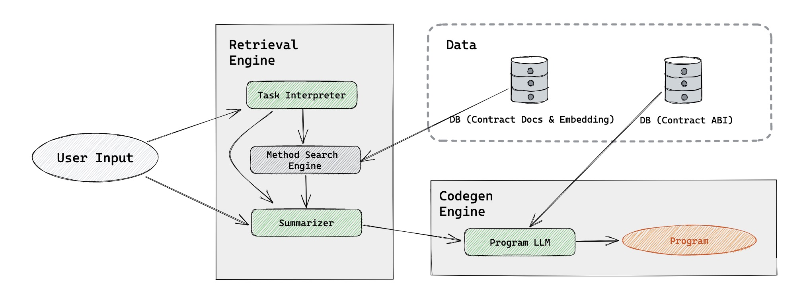

# Auto3 Copilot
> **Unleashing the programmable blockchain for everyone.（人人都是区块链科学家）**

Auto3 Copilot is a **versatile** and **easily expandable** Web3 tool that leverages GPT technology to generate programs efficiently for various blockchain tasks. Users can simply input specific requirements, and the system will generate **a one-click executable code**.

You can perform any combination of operations on supported protocols through simple natural language.


**Warning: Under very active development.**

**Supported protocols:**

- Supported chains: Ethereum (more chains comming soon.)
- DeFi (You can invoke any method of them via natural language):
  - Uniswap V2/V3
  - AAVE V3
  - Curve
  - ... (more protocols comming soon. It's very easy to extend)
- ERC20 Tokens: Almost all mainstream ERC20 tokens.

## Quickstart
### Installation
```bash
$ git clone git@github.com:Auto3-io/auto3-copilot.git
$ poetry install
$ export OPENAI_API_KEY=sk-xxxx
```

### Example usage
> **Query**: Swap 1000 USDC for ETH

```bash
$ poetry run copilot -i "Swap 1000 USDC for ETH"
```

> **Query**: Operate on Ethereum, Swap 1000 USDC for ETH, then send 0.1 amounts of ETH separately to two addresses (0xc9270B4d0aB7A92dC194eFC349d24c685A6A630d, 0x2A52e553D3fa7beb2C55fd4Cc94C5a3F659E8df8).

```bash
$ poetry run copilot -i "Operate on Ethereum, Swap 1000 USDC for ETH, then send 0.1 amounts of ETH separately to two addresses (0xc9270B4d0aB7A92dC194eFC349d24c685A6A630d, 0x2A52e553D3fa7beb2C55fd4Cc94C5a3F659E8df8)."
```

Some examples:
- Swap 1 ETH for USDC, then send all my usdc to0xc9270B4d0aB7A92dC194eFC349d24c685A6A630d`
- Convert all my ETH to USDC (leave 0.1 ETH), then deposit into AAVE V3.
- Provide 1 ETH and its corresponding USDC liquidity to the USDC/WETH Uniswap V2 pool.

## How it works.



It consists of the following components:

- **Database and Documentations for Smart Contracts**: A comprehensive database of on-chain smart contracts, ABIs, and documentation, improving search results for the search engine.
- **Task Interpreter**: Based on user input, outputs relevant crypto protocols and methods that need to be utilized.
- **Vector Search Engine with Summarizer**: Searches related methods and documentation of the protocol based on the keyword generated by Task Interpreter and user input. The Summarizer component generates specific methods and hints required by the Program LLM to generate a program that fulfills the user's purpose.
- **Program LLM**: Generates executable programs according to the output of the Summarizer and user input.

Once the user inputs their specific requirements, Auto3 Copilot processes the input and generates the corresponding executable code. The user can then review and execute the generated code as needed.

## Future
- **On-Chain and Off-Chain Event Monitoring**: We plan to integrate the tool with event monitoring capabilities, allowing developers to create automation programs that trigger when specific on-chain or off-chain events occur.

- **Time-Based Automation**: We also plan to add time-based automation capabilities, enabling developers to create programs that automatically execute at specific times or intervals.
